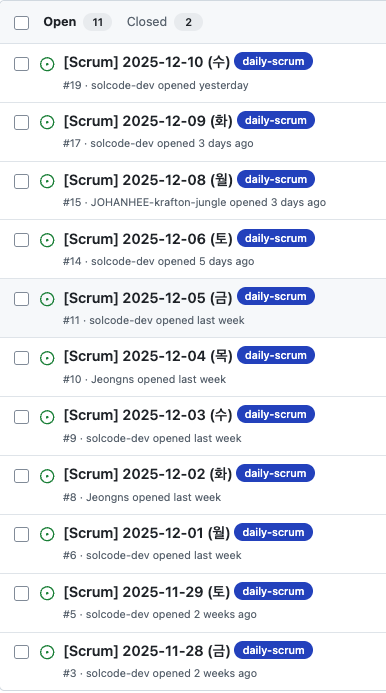

# 🎨 Pintos Project: Threads, User Programs, & Virtual Memory

> **학습 기간:** 2025.11.06 ~ 2025.12.11  
> **프로젝트 성격:** 운영체제(OS) 핵심 기능 구현 및 학습 (KAIST Pintos 기반)

## 📖 프로젝트 소개
이 저장소는 **Pintos 운영체제**의 핵심 기능들을 단계별로 직접 구현한 학습 기록입니다.

**Project 1 (Threads)**, **Project 2 (User Programs)**, **Project 3 (Virtual Memory)** 과정을 거치며 스레드 스케줄링과 동기화, 시스템 콜 인터페이스, 그리고 효율적인 가상 메모리 관리 시스템까지 운영체제의 필수 요소들을 심도 있게 구현하였습니다.

## ⚙️ 주요 구현 내용 (Features)

### 🔹 Project 1: Threads
* **Alarm Clock:** 기존의 Busy Waiting 방식을 Sleep/Wake Up 방식으로 개선하여 CPU 자원 낭비 최소화.
* **Priority Scheduling:** 우선순위 기반 스케줄링을 구현하고, 우선순위 역전(Inversion) 문제를 해결하기 위한 **Priority Donation** 기법 적용.

### 🔹 Project 2: User Programs
* **Argument Passing:** 커널이 유저 프로그램 시작 시 명령행 인자(Command Line Arguments)를 파싱하여 스택에 올바르게 전달하도록 구현.
* **System Calls:** 유저 모드 프로그램이 커널 기능을 사용할 수 있도록 파일 시스템 및 프로세스 관련 시스템 콜(`fork`, `exec`, `wait`, `open`, `read`, `write` 등) 핸들러 구현.
* **Process Hierarchy:** 부모-자식 프로세스 간의 계층 구조 및 종료 상태 관리.

### 🔹 Project 3: Virtual Memory
* **Memory Management:** 보조 페이지 테이블(Supplementary Page Table)과 프레임 테이블(Frame Table)을 구축하여 물리/가상 메모리 매핑 상태 관리.
* **Demand Paging (Lazy Loading):** 프로그램 실행 시 모든 세그먼트를 로드하지 않고, Page Fault 발생 시점에 메모리를 할당하는 지연 로딩 구현.
* **Stack Growth:** 유저 프로그램이 스택 제한을 넘어설 때, 허용 범위 내에서 스택 영역을 자동으로 확장.
* **Memory Mapped Files:** 파일 데이터를 메모리 주소 공간에 매핑하는 `mmap`, `munmap` 시스템 콜 구현.
* **Swap In/Out:** 물리 메모리 부족 시 LRU 기반 알고리즘(또는 Clock 알고리즘)을 통해 희생 프레임을 선정하고 디스크로 스왑 아웃/인 처리.

---

## 🛠 개발 환경 (Environment)
이 프로젝트는 **Docker** 컨테이너 기반의 일관된 환경에서 개발되었습니다.

* **OS:** Ubuntu 22.04 LTS (x86_64)
* **Language:** C, Assembly
* **Compiler:** GCC
* **Emulator:** QEMU
* **Tools:** GDB, Git

---

## 🤝 Collaboration & Process

### 1. Workflow & Pair Programming
저희 팀은 **낮에는 개인 작업, 밤에는 페어 프로그래밍** 이라는 루틴을 따랐습니다.

* **VS Code Live Share:** 복잡한 커널 로직을 구현할 때 **Live Share**를 적극 활용했습니다.
* 실시간으로 한 화면에서 코드를 작성하며 논리적 오류를 즉시 잡아내고 코드 퀄리티를 높였습니다.
  
* **Role-Based Branching:**
  * `feat/*`: 낮 시간 동안 개인이 맡은 기능을 선행 연구하고 구현을 시도하는 브랜치
  * `pair/*`: 저녁 시간에 팀원이 모여 검증된 코드를 함께 작성하고 완성하는 브랜치 

### 2. Team Convention & Knowledge Sharing (Wiki)
협업의 기준을 맞추기 위해 **GitHub Wiki**를 적극적으로 활용하여 규칙을 문서화하고 지식을 축적했습니다.
👉 **[Team Wiki 바로가기](https://github.com/solcode-dev/pintos-log/wiki)**

* **Coding Convention:** Linux Kernel Style을 기반으로 들여쓰기(4 spaces), 중괄호 위치 등을 통일하여 가독성을 확보했습니다. 
* **Commit Message Strategy:** `feat`, `fix`, `docs`, `refactor` 등 타입을 명확히 구분하고, 한글/영어 혼용을 방지하는 규칙을 세워 히스토리 관리를 체계화했습니다. 
* **Knowledge Base:** 난이도가 높은 개념(Context Passing, 구조체 초기화 등)을 공부한 뒤 Wiki에 정리하여 공유함으로써, 팀원 전체의 기술 이해도를 상향 평준화했습니다.

### 3. Daily Scrum & Issue Tracking
매일 아침 **Daily Scrum**을 진행하며 '어제 한 일', '오늘 할 일', 'Blocker(방해 요소)'를 공유했습니다. 구두 공유에 그치지 않고 **GitHub Issues**에 기록을 남겨 프로젝트의 진척도를 투명하게 관리했습니다.


<br/>*(실제 프로젝트 진행 당시 매일 기록한 데일리 스크럼 및 이슈 트래킹 내역)*

---

## 📂 디렉토리 구조
```text
pintos-log/
├── pintos/
│   ├── threads/    # Project 1: Threads (Scheduling, Synchronization)
│   ├── userprog/   # Project 2: User Programs (System Calls, Args)
│   ├── vm/         # Project 3: Virtual Memory (Paging, Swap, Stack Growth)
│   ├── filesys/    # Project 4: File System
│   └── ...
└── ...
```


## 🔗 Reference & License

* **Original Repository:** [jungle-pintos3/pintos-virtual-memory](https://github.com/jungle-pintos3/pintos-virtual-memory)
* **Based on:** [KAIST Pintos](https://github.com/casys-kaist/pintos-kaist)

### Contributors
* [solcode-dev](https://github.com/solcode-dev)
* [Jeongns](https://github.com/Jeongns)
* [JOHANHEE-krafton-jungle](https://github.com/JOHANHEE-krafton-jungle)

---
*This project was developed for educational purposes.*
